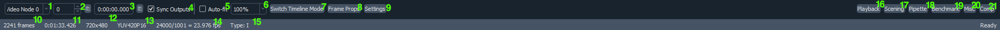
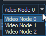
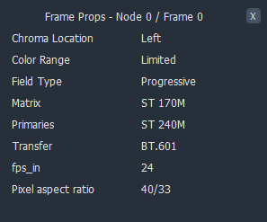

Main
----

The main toolbar is made to give basic information useful for previewing.

All the options in the image are numbered and correspond to an explanation.

\1. Video Node
^^^^^^^^^^^^^^

Dropdown menu of all available `Video Nodes`.
Clicking on a node switches ``vs-preview``\'s output to that node.

They can be given individual names by setting the ``Name`` frameprop.

\2. Frame index
^^^^^^^^^^^^^^^

Current frame number.
This is zero-indexed.

\3. Timestamp
^^^^^^^^^^^^^

Current timestamp in the video.
This is calculated based on the framerate and current frame.

\4. Sync Outputs
^^^^^^^^^^^^^^^^

Sync frame numbers of each Video Node.
Toggling this off allows you to view different frames on different Nodes
without them automatically syncing up.

\5. Auto-fit
^^^^^^^^^^^^

Automatically fit the current frame into the preview window.

\6. Zoom level
^^^^^^^^^^^^^^

Sets the zoom level.
Default is 100%.

\7. Switch Timeline Mode
^^^^^^^^^^^^^^^^^^^^^^^

Switches timeline between frame numbers and timestamps
Default is timestamp mode.

\8. Frame Props
^^^^^^^^^^^^^^

Displays the frame properties of the clip on screen.
This only includes base frameprops, and automatically includes PlaneStats info.

\9. Settings
^^^^^^^^^^^^

Opens the ``vs-preview`` settings menu.

\10. Total frames
^^^^^^^^^^^^^^^^^

Total amount of frames of the current Node.

\11. Total time
^^^^^^^^^^^^^^^

Total time of the current Node.
This is calculated based on the framerate and total frames.

\12. Video Resolution
^^^^^^^^^^^^^^^^^^^^^

Dimensions of the current Node.
Displayed as \[width\]x\[height\] (ie. 1920x1080).

\13. Video Format
^^^^^^^^^^^^^^^^^

Format of the current Node.
This follows ``VapourSynth`` convention, \[colorformat\]\[subsampling\]\[bitdepth\] (ie. YUV420P16).

\14. Video Framerate
^^^^^^^^^^^^^^^^^^^^

Framerate of the current Node.
Displayed as \[Numerator\]/\[Denomenator\] = \[FPS\].

\15. Frame Type
^^^^^^^^^^^^^^^

Frame type of the current frame of the current Node.
This can be an I, B, or P type.

\16. Playback
^^^^^^^^^^^^^

Enable the playback toolbar.
Default is untoggled.

\17. Scening
^^^^^^^^^^^^

Enable the scening toolbar.
Default is untoggled.

\18. Pipette
^^^^^^^^^^^^

Enable the pipette toolbar.
Default is untoggled.

\19. Benchmark
^^^^^^^^^^^^^^

Enable the benchmarking toolbar.
Default is untoggled.

\20. Misc
^^^^^^^^^

Enable the misc toolbar.
Default is untoggled.

\21. Comp
^^^^^^^^^

Enable the comp toolbar.
Default is untoggled.
