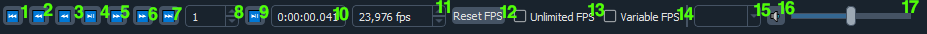

Playback
--------

The playback toolbar is centered around video playback.

All the options in the image are numbered and correspond to an explanation.

.. note::

    When an option mentions "FPS", that means "Frames Per Second"!

\1. Seek to first frame
^^^^^^^^^^^^^^^^^^^^^^^

Seeks to the first frame of the Node.

\2. Seek N frames backwards
^^^^^^^^^^^^^^^^^^^^^^^^^^^

Seeks N frames backwards.
N is set in `Seek frames to step`.

\3. Seek 1 frame backwards
^^^^^^^^^^^^^^^^^^^^^^^^^^

Seeks 1 frame backwards.

\4. Play/Pause
^^^^^^^^^^^^^^

Plays or pauses the Node.

\5. Seek 1 frame forwards
^^^^^^^^^^^^^^^^^^^^^^^^^

Seeks 1 frame forwards.

\6. Seek N frames forwards
^^^^^^^^^^^^^^^^^^^^^^^^^^

Seeks N frames forwards.
N is set in `Seek frames to step`.

\7. Seek to last frame
^^^^^^^^^^^^^^^^^^^^^^

Seeks to the last frame of the Node.

\8. Seek N frames step
^^^^^^^^^^^^^^^^^^^^^^

Select a number of frames to framestep.
This is the N value for `Seek N frames backwards`/`forwards` and `Play N frames`.

\9. Play N frames
^^^^^^^^^^^^^^^^^

Plays the Node for N frames.
N is set in `Seek N frames step`.

\10. Seek N frames timestamp
^^^^^^^^^^^^^^^^^^^^^^^^^^^^

The N from `Seek N frames step` in timestamps.

\11. Playback framerate
^^^^^^^^^^^^^^^^^^^^^^^

Framerate to play the Node back at.
Defaults to Node's framerate.D
Disabled if `Variable FPS` is enabled.

\12. Reset FPS
^^^^^^^^^^^^^^

Resets the framerate back to the Node's framerate.

\13. Unlimited FPS
^^^^^^^^^^^^^^^^^^

Play the Node back at an unset FPS.
This will go as fast as your system can keep up.

\14. Variable FPS
^^^^^^^^^^^^^^^^^

Play the Node back at a variable framerate.
This requires the ``_FrameDen`` and ``_FrameNum`` frameprops to be set.

\15. Audio Node
^^^^^^^^^^^^^^^

Audio Node to play back.
Similar to Video Node,
selecting an item in the dropdown menu will switch between Audio Nodes.

\16. Mute
^^^^^^^^^

Toggle the audio mute.

\17. Volume slider
^^^^^^^^^^^^^^^^^^

Slider indicating how loud the AudioNode is.
